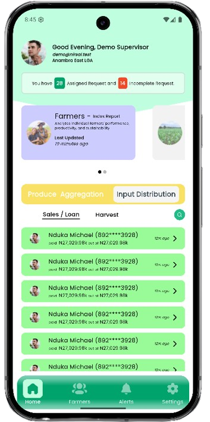
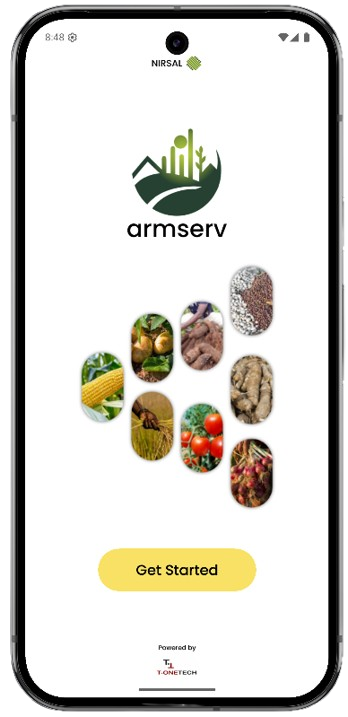
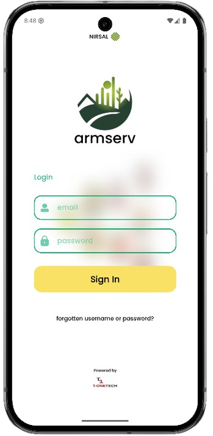
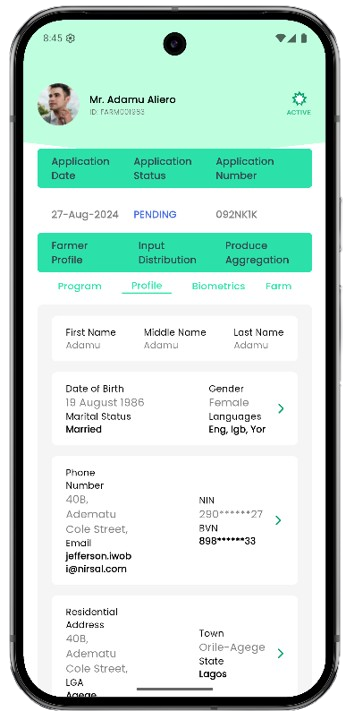
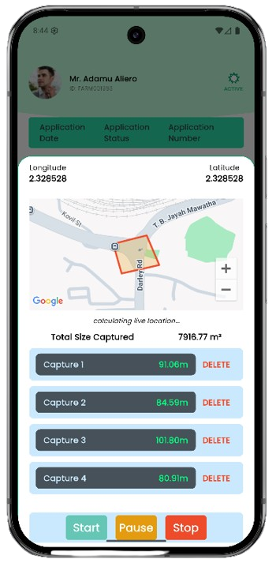

# 🌱 NIRSAL Mobile

     

Mobile field app for NIRSAL built with Flutter, integrating a Laravel backend. Supports offline-first capture flows and field mapping for farm area calculation.

## Key Features
- **Laravel backend integration**: API base URLs are configured in [lib/config/app_config.dart](lib/config/app_config.dart). Auth tokens and user profiles persist locally via shared preferences so users stay signed in between sessions.
- **Offline data cache and deferred sync**: Captured data and auth context are kept locally (shared preferences + in-app state). When connectivity is restored, the app can sync queued updates to the Laravel API, preventing data loss in the field.
- **Farm area calculation (main feature)**: Uses Google Maps + Geolocator to capture farm boundaries, render polygons, and calculate both total area and segment lengths. A dummy polygon is available for offline/demo mode so the UI still shows an example shape and computed metrics.
- **Authentication flows**: Email/password login, fingerprint login screen, and a settings-based logout. Dummy data mode is available for fully offline demos.
- **Farmer and dashboard views**: Carousels, cards, and tabbed screens for recent updates, farmers, assignments, and notifications.

## Tech Stack
- 🐦 Flutter with Provider state management
- 🔗 Dio for HTTP (when pointed at Laravel API)
- 🗺️ Google Maps Flutter + Geolocator for geospatial capture
- 💾 Shared Preferences for local caching of tokens and user profile
- 🧬 json_serializable for typed models

## Setup
1. Install Flutter (3.3.4+), Android/iOS toolchains.
2. Fetch deps: `flutter pub get`.
3. Configure backend endpoints in [lib/config/app_config.dart](lib/config/app_config.dart) for your Laravel API.
4. Run: `flutter run` (use an emulator or device with Google Play services for map features).

### Offline / Demo mode
- The app can run without network using the bundled dummy data and dummy map polygon. Login with the dummy users defined in [lib/dummy_data/users.dart](lib/dummy_data/users.dart) (e.g., `demo@nirsal.test` / `password123`).
- Captured shapes and metrics render locally; syncing can be enabled once connectivity and API are available.

## Screenshots
| Dashboard | Get Started | Login | Farmer Detail | Area Capture |
| --- | --- | --- | --- | --- |
|  |  |  |  |  |

## Development Notes
- Initial route: Splash → Welcome/Login → Main tabs (Home, Farmers, Dashboard, Settings).
- Logout lives in Settings and clears local auth state before returning to Welcome.
- Gradle/AGP are upgraded for modern toolchain support (see android/gradle/wrapper and android/settings.gradle).

## Contributing
1. Create a branch.
2. Make changes and add tests where relevant.
3. Submit a PR.
